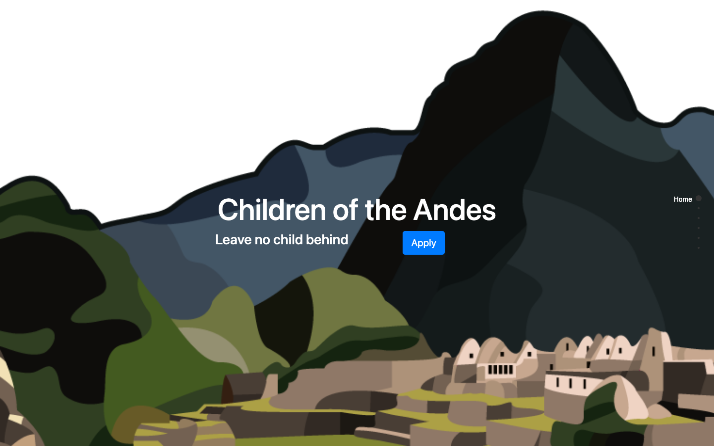

# Children of the Andes

Static website for a volunteer program that brings teachers to the children of San Pedro, a remote village in Peru. Built in 24 hours at HackMerced 2019.

<p align="center">
  
</p>

The site is a single scrolling page (fullPage.js) with six sections: home, about, trip schedule, a Skyscanner flight-search widget, a learning section, and contact. `map.html` is a Mapbox GL view of Lima, the first stop on the trip. The **Download Modules** button fetches a zip of English worksheets from this repo's [releases](https://github.com/gr8monk3ys/children-of-the-andes/releases/tag/learning-modules); it lives there rather than in the tree because San Pedro has no internet, so volunteers print everything before they go. Math worksheets are in `learning/Math/`.

## Run locally

There is no build step. Serve the directory with any static server:

```sh
python3 -m http.server 8000
open http://localhost:8000
```

Everything else (Bootstrap, jQuery, fullPage.js, Mapbox GL, the Skyscanner widget) loads from a CDN, so you need to be online.

## Layout

```
index.html        the one-page site
map.html          Mapbox GL map of Lima
Script.js         fullPage.js and Typeform setup
css/style.scss    source; style.css is the compiled output
assets/           photos and logos
learning/Math/    printable worksheets
```

## Credits

Lorenzo Scaturchio, Paulo, and Jet, for HackMerced 2019. Worksheets in `learning/` come from third-party sources. MIT licensed (see `LICENSE`).
